### Course: RPAD 676 Data Science for the Public Good
### Instructor: Dr. Kayla Schwoerer
### Assignment: Final project
### Student: Zong-Xian Huang

# 1. Project rationales

Police misconduct is a severe issue in the United States, closely entangled with debates regarding racial equity, racial disparities, and public accountability. Among these law enforcement entities, the New York Police Department (NYPD) is one of the most influential and important police departments in the country. As the NYPD serves a diverse and extremely large population in New York City, the policing behaviors conducted by the police may inevitably involve a significant number of disputes or complaints from citizens and impacted individuals.

As a result, this final project focuses on the misconduct complaints against the NYPD, investigating questions related to the disciplinary actions given to police officers accused of various types of misconduct. My core questions for the final project are: **What factors explain whether police officers are penalized or not for their misconduct?** And **In these officers who got penalties, what factors explain the different penalties given to police officers?** To address these questions, this project will analyze the NYPD Misconduct Complaint Database using two different approaches to discuss the penalties that police officers receive after an impacted person has submitted a claim of misconduct.

# 2. Data

**[The NYPD Misconduct Complaint Database](https://www.nyclu.org/data/nypd-misconduct-database)**, constructed by the New York Civil Liberties Union (NYCLU), will serve as the primary dataset for this project. This dataset includes 302,801 unique complaint records covering 107,187 incidents since 2000. It features basic descriptions of incidents, such as complaint categories and associated allegations. More importantly, it records the names of police officers involved in misconduct, as well as the types of NYPD penalties imposed on these officers. Additionally, this dataset includes demographic information regarding the race of both officers and impacted individuals, which enables the analysis of interactions between different racial groups. The raw data can be accessed from the GitHub repository **[here](https://github.com/new-york-civil-liberties-union/NYPD-Misconduct-Complaint-Database-Updated)**.

# 3. Data processing and descriptive statistics


```python
# Loading the libraries
import pandas as pd
import numpy as np
import matplotlib.pyplot as plt
import seaborn as sns

# Loading dataset
data = pd.read_csv('CCRB Complaint Database Raw 04.28.2023.csv', low_memory=False)
df = pd.DataFrame(data)
```

## 3-1. Outcome variable

I use two different outcome variables to address the research questions: (1) a binary variable indicating whether officers receive a penalty/discipline or not, and (2) a categorical variable specifying the types of discipline given to officers who are disciplined. All penalty decisions that are pending will be treated as missing values in further analysis. The recoding of these outcome variables will be explained in this section.

### 3-1-1. Whether officers get penalty or not

First, the penalty variable is recoded as a binary variable, which indicates whether an officer has been given a penalty. According to Figure 1, more than 90% of officers (282,210) do not receive discipline after an impacted person submits a complaint, which suggests that the complaints may not be directly associated with whether officers receive discipline or penalties.


```python
# Recode binary variable for penalty/ non-penalty
def recode_penalty_binary(description):
    original_description = description  # Keep the original for debugging
    description = str(description).strip().lower()  # Ensure the description is treated as a string and strip whitespaces
    if pd.isna(description):
        return description  # Return NaN as is if the value is NaN
    elif "pending" in description:
        return np.nan
    elif "no discipline" in description.lower() in description.lower():
        return 0 # coding no discipline as 0
    else:
        return 1
df['Penalty_binary'] = df['PenaltyCat'].apply(recode_penalty_binary)
```


```python
### Visualization 
# Count the occurrences of each category
penalty_counts = df['Penalty_binary'].value_counts()
# Create a bar chart
sns.set(style="whitegrid")
ax = sns.barplot(x=penalty_counts.index, y=penalty_counts.values, palette='coolwarm')
plt.title('Figure 1: Distribution of Penalty Outcomes (binary)')
plt.xlabel('Penalty Outcome')
plt.ylabel('Frequency')
plt.xticks(ticks=[0, 1], labels=['No Penalty', 'Penalty'])  # Assuming 0 is 'No Penalty' and 1 is 'Penalty'
# Adding text on the top of bar
for p in ax.patches:
    ax.annotate(format(p.get_height(), '.0f'),  # Format the count to be displayed
                (p.get_x() + p.get_width() / 2., p.get_height()),  # Position for the text
                ha = 'center',  # Center the text horizontally
                va = 'center',  # Center the text vertically within the bar
                xytext = (0, 5),  # Distance from the top of the bar
                textcoords = 'offset points',
                fontsize=10)  # Optional: adjust fontsize
plt.show()
```


    
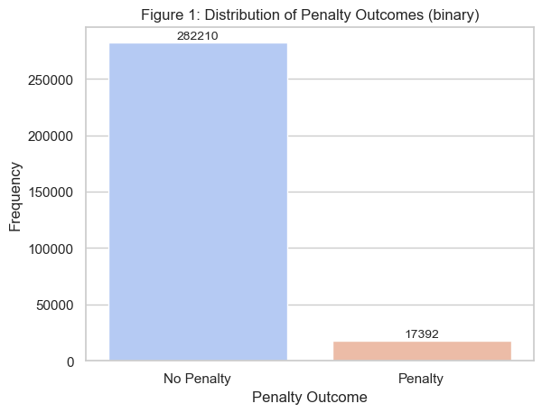
    


### 3-1-2. What types of discipline given to officers who are disciplined

Second, the penalty is categorized into three groups based on **[NYPD police discipline categories](https://www.nyc.gov/site/ccrb/complaints/complaint-process/police-discipline.page)**: (1) Charges and Specifications, which represent the most serious allegations of misconduct, potentially resulting in lost vacation days, suspension, or even termination; (2) Command Disciplines, which entail moderate punishments such as the loss of up to ten vacation days; (3) Instructions or Formalized Training, often recommended for officers who misunderstand policy and considered the least severe discipline such as reprimand or warns. 

Based on Figure 2, we can observe that among those police officers who have received discipline, the mildest form of discipline (instruction and training) is the most commonly given, while the most severe disciplines, such as loss of vacation or termination, are the least frequently administered.


```python
# Recode the penalty descritpion based on four categories
def recode_penalty_descriptions(description):
    original_description = description  # Keep the original for debugging
    description = str(description).strip().lower()  # Ensure the description is treated as a string and strip whitespaces
    charges_and_specifications = ['loss of vacation', 'resigned/retired', 'probation', 'suspension', 'termination']
    if pd.isna(description):
        return description  # Return NaN as is if the value is NaN
    elif "pending" in description:
        return np.nan
    elif "no discipline" in description:
        return np.nan
    elif "command discipline" in description:
        return "Command discipline"
    elif "reprimand" in description:
        return 'Instructions and trainings'
    elif any(position in description for position in charges_and_specifications):
        return 'Charges and specifications'
    else:
        # Print descriptions that are not being recoded for debugging
        print(f"Unmatched description: {original_description}")
        return 'Unspecified'

# Apply the recoding function to the 'PenaltyDesc' column
df['Penalty_categories'] = df['PenaltyCat'].apply(recode_penalty_descriptions)
```


```python
### Visualization 
# Count the occurrences of each category
penalty_counts = df['Penalty_categories'].value_counts()
# Create a bar chart
sns.set(style="whitegrid") # set up the grid line
ax = sns.barplot(x=penalty_counts.index, y=penalty_counts.values, palette='coolwarm')
plt.title('Figure 2: Types of Penalty Outcomes')
plt.xlabel('Penalty Types')
plt.ylabel('Frequency')
plt.xticks(fontsize = 8)  # Adjusting font size
# Adding number on the top of bar
for p in ax.patches:
    ax.annotate(format(p.get_height(), '.0f'),  # Format the count to be displayed
                (p.get_x() + p.get_width() / 2., p.get_height()),  # Position for the text
                ha = 'center',  # Center the text horizontally
                va = 'center',  # Center the text vertically within the bar
                xytext = (0, 5),  # Distance from the top of the bar
                textcoords = 'offset points',
                fontsize=10)  # Optional: adjust fontsize
plt.show()
```


    
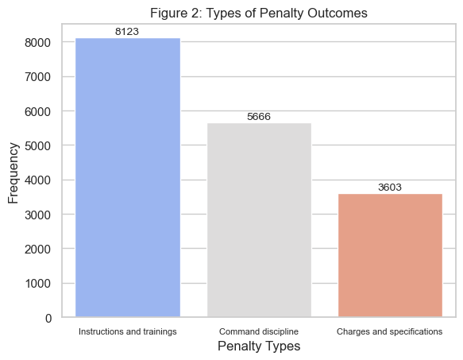
    


## 3-2. Explanatory variables

I have also included several explanatory variables to elucidate the outcome variables, such as the age, gender, and race of impacted individuals; the gender and race of officers; the gender and racial differences between officers and impacted individuals; as well as the allegations made against the officers, which are investigated by the Civilian Complaint Review Board (CCRB). I will explain the processing of these variables, respectively.

### 3-2-1. Sex of officer/impacted person 

Although the variable name in the raw dataset is "gender," the information it contains is actually sex (male/female). To avoid confusion, I recode this variable and will refer to this variable as "sex" in the subsequent analysis. Figures 3-1 and 3-2 show the distribution of reported sex for officers and impacted persons. Generally, more than 90% of officers who receive complaints are male, and more than 75% of impacted persons are male.


```python
def gender_recoder(gender):
    if pd.isna(gender):
        return gender  # Return NaN as is if the value is NaN
    description = str(gender)  # Ensure the description is treated as a string
    if 'female/woman' in gender.lower() or 'female' in gender.lower():
        return 0
    elif 'male/man' in gender.lower() or 'male' in gender.lower():
        return 1
    else: 
        return np.nan

df['Impacted_sex_male'] = df['ImpactedGender'].apply(gender_recoder)
df['Police_sex_male'] = df['OfficerGender'].apply(gender_recoder)
```


```python
# Aggregate the data
police_gender_counts = df['Police_sex_male'].value_counts()
impacted_gender_counts = df['Impacted_sex_male'].value_counts()

# Create a figure with subplots
fig, axes = plt.subplots(1, 2, figsize=(14, 6))  # 1 row, 2 columns

# Bar plot for police gender distribution
sns.barplot(ax=axes[0], x=police_gender_counts.index, y=police_gender_counts.values, palette='coolwarm')
axes[0].set_title('Figure 3-1: Police Sex Distribution')
axes[0].set_xlabel('Sex')
axes[0].set_ylabel('Frequency')
axes[0].set_xticklabels(['Female', 'Male'])

# Adding numbers on top of the bars for police
for p in axes[0].patches:
    axes[0].annotate(f'{int(p.get_height())}', 
                     (p.get_x() + p.get_width() / 2., p.get_height()), 
                     ha='center', va='center', 
                     xytext=(0, 5), 
                     textcoords='offset points')

# Bar plot for impacted persons' gender distribution
sns.barplot(ax=axes[1], x=impacted_gender_counts.index, y=impacted_gender_counts.values, palette='coolwarm')
axes[1].set_title('Figure 3-2: Impacted Persons Sex Distribution')
axes[1].set_xlabel('Sex')
axes[1].set_ylabel('Frequency')
axes[1].set_xticklabels(['Female', 'Male'])
# Adding numbers on top of the bars for police
for p in axes[1].patches:
    axes[1].annotate(f'{int(p.get_height())}', 
                     (p.get_x() + p.get_width() / 2., p.get_height()), 
                     ha='center', va='center', 
                     xytext=(0, 5), 
                     textcoords='offset points')

# Display the plot
plt.tight_layout()
plt.show()
```


    
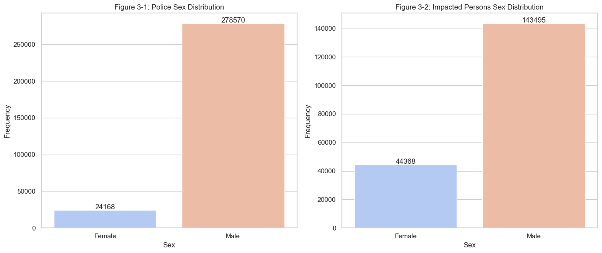
    


## 3-2-2. Race of officer/impacted person

In terms of the variable "Race," I recoded it into a binary variable indicating White and non-White officers/impacted persons. Respondents who refused to report their race, and those who self-reported as White or Caucasian, are categorized as the White population. All others are recoded as non-White populations. It is important to note that this recoding may introduce heterogeneity within the non-White category, as it could include Black, Hispanic, or Asian and other populations. However, as a pilot study, I argue that this differentiation between White and non-White population still provides meaningful insights into racial attributes in the data, and future studies could try to employ a more complex recoding process for race.

According to Figures 4-1 and 4-2, it is important to note that more than half of the NYPD officers are White, whereas less than 15% of impacted persons are reported as belonging to the White population.


```python
def race_recoder(race):
    # List of other race for dropping as NA
    NA_list = ['Unknown', 'Refused', 'Decline to Answer (NA)']
    White_list = ['White', 'White/Caucasian (R)']
    # Check if the rank is in non-managerial positions
    if pd.isna(race):
        return race  # Return NaN as is if the value is NaN
    elif any(position in race for position in NA_list):
        return np.nan
    elif any(position in race for position in White_list):
        return 1
    else:
        return 0

df['Impacted_race_white'] = df['ImpactedRace'].apply(race_recoder)
df['Police_race_white'] = df['OfficerRace'].apply(race_recoder)
```


```python
# Aggregate the data
police_race_counts = df['Police_race_white'].value_counts()
impacted_race_counts = df['Impacted_race_white'].value_counts()

# Create a figure with subplots
fig, axes = plt.subplots(1, 2, figsize=(14, 6))  # 1 row, 2 columns

# Bar plot for police gender distribution
sns.barplot(ax=axes[0], x=police_race_counts.index, y=police_race_counts.values, palette='coolwarm')
axes[0].set_title('Figure 4-1: Police Race Distribution')
axes[0].set_xlabel('Race')
axes[0].set_ylabel('Frequency')
axes[0].set_xticklabels(['non-White', 'White'])

# Adding numbers on top of the bars for police
for p in axes[0].patches:
    axes[0].annotate(f'{int(p.get_height())}', 
                     (p.get_x() + p.get_width() / 2., p.get_height()), 
                     ha='center', va='center', 
                     xytext=(0, 5), 
                     textcoords='offset points')

# Bar plot for impacted persons' gender distribution
sns.barplot(ax=axes[1], x=impacted_race_counts.index, y=impacted_race_counts.values, palette='coolwarm')
axes[1].set_title('Figure 4-2: Impacted Persons Race Distribution')
axes[1].set_xlabel('Race')
axes[1].set_ylabel('Frequency')
axes[1].set_xticklabels(['non-White', 'White'])
# Adding numbers on top of the bars for police
for p in axes[1].patches:
    axes[1].annotate(f'{int(p.get_height())}', 
                     (p.get_x() + p.get_width() / 2., p.get_height()), 
                     ha='center', va='center', 
                     xytext=(0, 5), 
                     textcoords='offset points')

# Display the plot
plt.tight_layout()
plt.show()
```


    
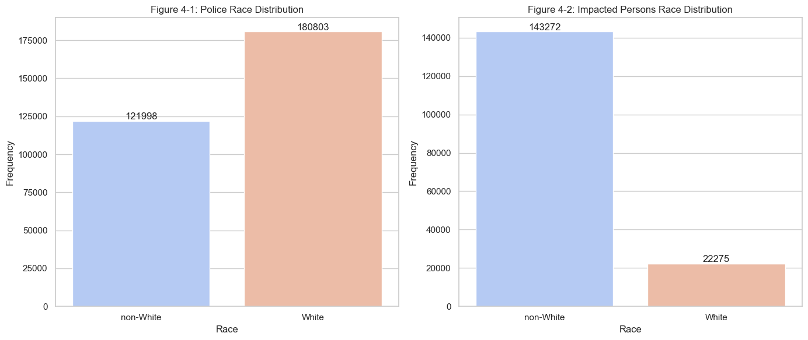
    


## 3-2-3. Age of impacted person 

Age is a continuous variable in the original dataset. Given that some values appear unrealistic for representing the age of impacted persons, such as negative values or extremely high ages, I have recoded ages less than 10 or greater than 99 as missing values. Figure 5 reports the distribution of age groups of impacted persons, showing that most impacted persons are adults aged between 20 and 29 years old.


```python
# dropping impacted age less than 10 or higher than 99 as NA 
def age_recoder(age_num):
    if age_num < 10:
        return np.nan
    elif age_num > 99:
        return np.nan
    else:
        return age_num

df['Impacted_age_recoded'] = df['ImpactedAge'].apply(age_recoder)
```


```python
# Define bins for the histogram
bins = range(0, 110, 10)  # Defines bins from 0 to 100 by 10s

# Plotting the histogram using seaborn
plt.figure(figsize=(12, 6))
sns.histplot(df['Impacted_age_recoded'], bins=bins, kde=False, color='skyblue')

# Setting titles and labels
plt.title('Figure 5: Impacted Persons\' Ages')
plt.xlabel('Age Group')
plt.ylabel('Frequency')

# Remove the straight grid line because it is ugly
plt.grid(axis = 'x')

# Set x-ticks to be in the middle of the bins
plt.xticks(ticks=[(a + b) / 2 for a, b in zip(bins[:-1], bins[1:])], labels=[f"{a}-{b - 1}" for a, b in zip(bins[:-1], bins[1:])])

plt.show()
```


    
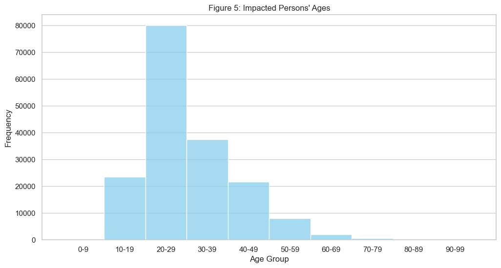
    


## 3-2-4. Ranks of officers

Rank is another important variable for officers. I recoded street-level police officers and detectives as non-managerial positions, and ranks above these are recoded as managerial positions. According to Figure 6, more than two-thirds of the complaints are issued toward behaviors conducted by officers in non-managerial positions (street-level positions).


```python
# Recoding the ranking of polices
def rank_recoder(rank):
    # List of non-managerial positions
    non_managerial = ['Police Officer', 'Detective']
    # List of managerial positions
    managerial = ['Sergeant', 'Lieutenant', 'Captain', 'Deputy Inspector', 'Chiefs and other ranks']

    if any(position in rank for position in managerial):           # Check if the rank is in managerial positions
        return 1
    elif any(position in rank for position in non_managerial):     # Check if the rank is in non-managerial positions
        return 0
    else:                                                          # Return NaN for all other cases
        return np.nan


df['Police_rank_mangerial'] = df['CurrentRankLong'].apply(rank_recoder)
```


```python
### Visualization 
# Count the occurrences of each category
rank_counts = df['Police_rank_mangerial'].value_counts()
# Create a bar chart
sns.set(style="whitegrid")
ax = sns.barplot(x=rank_counts.index, y=rank_counts.values, palette='coolwarm')
plt.title('Figure 6: Distribution of Officers Ranks')
plt.xlabel('Penalty Outcome')
plt.ylabel('Frequency')
plt.xticks(ticks=[0, 1], labels=['Non-mangerial', 'Mangerial'])  # Assuming 0 is 'No Penalty' and 1 is 'Penalty'
# Adding text on the top of bar
for p in ax.patches:
    ax.annotate(format(p.get_height(), '.0f'),  # Format the count to be displayed
                (p.get_x() + p.get_width() / 2., p.get_height()),  # Position for the text
                ha = 'center',  # Center the text horizontally
                va = 'center',  # Center the text vertically within the bar
                xytext = (0, 5),  # Distance from the top of the bar
                textcoords = 'offset points',
                fontsize=10)  # Optional: adjust fontsize
plt.show()
```


    
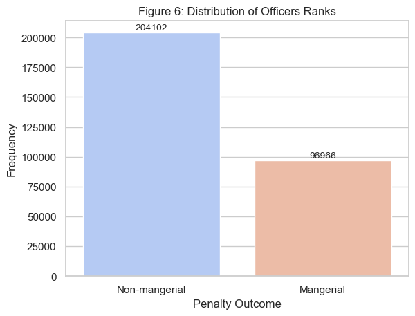
    


## 3-2-5. Allegations to officers

Allegations toward officers indicate the categories of misconduct within the CCRB's jurisdiction, which originally include Force, Abuse of Authority, Discourtesy, and Offensive Language. I have converted two categories with notably fewer cases—untruthful statements and bias-based policing—into missing values, as they each contain fewer than 200 cases in the dataset. According to Figure 7, the most common types of allegations are abuse of authority and inappropriate force, while offensive language is the least accused about category.


```python
df['FADOType'].value_counts()
```


    FADOType
    Abuse of Authority      105907
    Force                   104124
    Discourtesy              54681
    Abuse Of Authority       27429
    Offensive Language       10484
    Untruthful Statement       158
    Bias-Based Policing         18
    Name: count, dtype: int64


```python
def fado_recoder(fado):
    if pd.isna(fado):
        return fado  # Return NaN as is if the value is NaN
    elif 'Abuse' in fado:
        return 'Abuse of authority'
    elif 'Force' in fado:
        return 'Force'
    elif 'Discourtesy' in fado:
        return 'Discourtesy'
    elif 'Offensive' in fado:
        return 'Offensive language'
    else:                           ### The number of untruthful statement and Bias-Based Policing are too less, converting into NA 
        return np.nan
df['FADO_recoded'] = df['FADOType'].apply(fado_recoder)
```


```python
### Visualization 
# Count the occurrences of each category
fado_counts = df['FADO_recoded'].value_counts()
# Create a bar chart
sns.set(style="whitegrid") # set up the grid line
ax = sns.barplot(x=fado_counts.index, y=fado_counts.values, palette='coolwarm')
plt.title('Figure 7: Distribution of Allegation types')
plt.xlabel('Allegation types')
plt.ylabel('Frequency')
plt.xticks(fontsize = 8)  # Adjusting font size
# Adding number on the top of bar
for p in ax.patches:
    ax.annotate(format(p.get_height(), '.0f'),  # Format the count to be displayed
                (p.get_x() + p.get_width() / 2., p.get_height()),  # Position for the text
                ha = 'center',  # Center the text horizontally
                va = 'center',  # Center the text vertically within the bar
                xytext = (0, 5),  # Distance from the top of the bar
                textcoords = 'offset points',
                fontsize=10)  # Optional: adjust fontsize
plt.show()
```


    
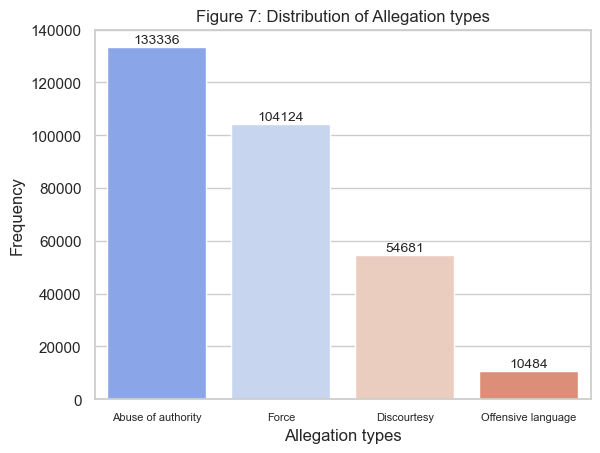
    


```python
# Incorporating FADO as dummy variables into data.frame
fado_dummies = pd.get_dummies(df['FADO_recoded'], drop_first = True, prefix='FADO', dtype = 'int')
df = pd.concat([df, fado_dummies], axis=1)
```

### 3-2-6. Mismatch of officer/impact person sex

I recoded the misalignment of sex between officers and impacted persons, as it is possible that this mismatch may affect the interactions between officers and impacted persons during incidents, potentially influencing the outcome variables that determine the penalty outcomes for officers. According to Figure 8, most complaints occur under conditions of sex alignment (male officer to male impacted person/female officer to female impacted person), and fewer than one quarter of cases involve sex mismatches.


```python
df['Sex_mismatch'] = np.where(
    pd.isna(df['Police_sex_male']) | pd.isna(df['Impacted_sex_male']),  # Check for NA in either column
    np.nan,  # If either is NA, set the result to NA
    np.where(df['Police_sex_male'] != df['Impacted_sex_male'], 1, 0)  # Else calculate mismatch
    )
```


```python
### Visualization 
# Count the occurrences of each category
gender_mismatch_counts = df['Sex_mismatch'].value_counts()
# Create a bar chart
sns.set(style="whitegrid")
ax = sns.barplot(x=gender_mismatch_counts.index, y=gender_mismatch_counts.values, palette='coolwarm')
plt.title('Figure 8: Distribution of Sex Alignment/Mismatch')
plt.xlabel('Outcome')
plt.ylabel('Frequency')
plt.xticks(ticks=[0, 1], labels=['Sex Alignment', 'Sex mismatch'])  # Assuming 0 is 'No Penalty' and 1 is 'Penalty'
# Adding text on the top of bar
for p in ax.patches:
    ax.annotate(format(p.get_height(), '.0f'),  # Format the count to be displayed
                (p.get_x() + p.get_width() / 2., p.get_height()),  # Position for the text
                ha = 'center',  # Center the text horizontally
                va = 'center',  # Center the text vertically within the bar
                xytext = (0, 5),  # Distance from the top of the bar
                textcoords = 'offset points',
                fontsize=10)  # Optional: adjust fontsize
plt.show()
```


    
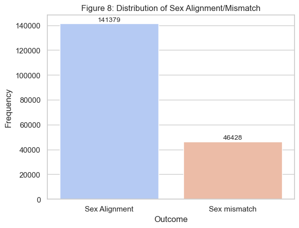
    


### 3-2-7. Mismatch of officer/impact person race

Following a similar rationale used for recoding sex mismatches, I also recoded the mismatch of race between officers and impacted persons. Figure 9 shows that more than half of the complaints involve race mismatches, which reflect potential conflicts between White police officers and non-White populations, or vice versa.


```python
df['Race_mismatch'] = np.where(
    pd.isna(df['Police_race_white']) | pd.isna(df['Impacted_race_white']),  # Check for NA in either column
    np.nan,  # If either is NA, set the result to NA
    np.where(df['Police_race_white'] != df['Impacted_race_white'], 1, 0)  # Else calculate mismatch
    )
```


```python
### Visualization 
# Count the occurrences of each category
race_mismatch_counts = df['Race_mismatch'].value_counts()
# Create a bar chart
sns.set(style="whitegrid")
ax = sns.barplot(x=race_mismatch_counts.index, y=race_mismatch_counts.values, palette='coolwarm')
plt.title('Figure 9: Distribution of Race Alignment/Mismatch')
plt.xlabel('Outcome')
plt.ylabel('Frequency')
plt.xticks(ticks=[0, 1], labels=['Race Alignment', 'Race mismatch'])  # Assuming 0 is 'No Penalty' and 1 is 'Penalty'
# Adding text on the top of bar
for p in ax.patches:
    ax.annotate(format(p.get_height(), '.0f'),  # Format the count to be displayed
                (p.get_x() + p.get_width() / 2., p.get_height()),  # Position for the text
                ha = 'center',  # Center the text horizontally
                va = 'center',  # Center the text vertically within the bar
                xytext = (0, 5),  # Distance from the top of the bar
                textcoords = 'offset points',
                fontsize=10)  # Optional: adjust fontsize
plt.show()
```


    
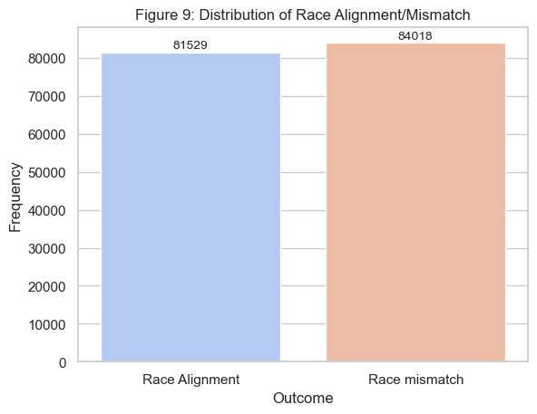
    


### 3-2-8. Incident years

I extracted the incident year from the variable "incident dates" to serve as the year-fixed effect in subsequent analyses. Year-fixed effects can control for unobserved factors that may vary over time, such as public attitudes toward officers' misconduct.


```python
# recoding year
df['IncidentDate'] = pd.to_datetime(df['IncidentDate'])
df['IncidentYear'] = df['IncidentDate'].dt.year
# Filter out years less than 2000 or greater than 2023
df['IncidentYear'] = df['IncidentYear'].apply(lambda x: x if 2000 <= x < 2023 else np.nan)
```


```python
# Drop NA to clean data for visualization
year_counts = df['IncidentYear'].dropna().value_counts().sort_index()

# Create a bar chart
plt.figure(figsize=(14, 6))
sns.barplot(x=year_counts.index, y=year_counts.values, palette='coolwarm')
plt.title('Figure 10: Complaints by Year')
plt.xlabel('Year')
plt.ylabel('Number of Complaints')
plt.xticks(rotation=45)  # Rotate x labels for better readability
plt.show()
```


    
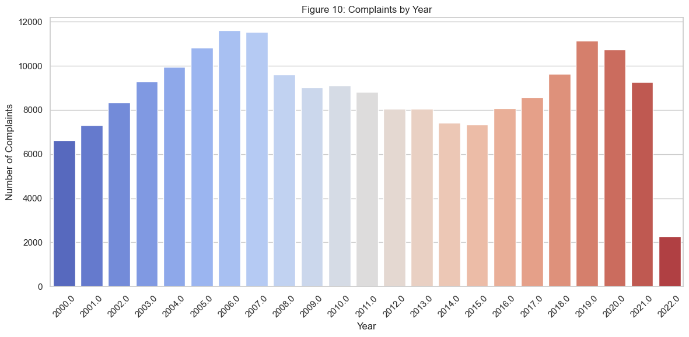
    


```python
# Incorporating YEAR as dummy variables into data.frame
incident_year_dummies = pd.get_dummies(df['IncidentYear'], drop_first = True, prefix='Year', dtype = 'int')
df = pd.concat([df, incident_year_dummies], axis=1)
```


```python
### Finalizing the data pre-processing
print(df.columns)
```

    Index(['AsOfDate', 'AllegationID', 'LastName', 'FirstName', 'OfficerRace',
           'OfficerGender', 'TaxID', 'CurrentRank', 'CurrentRankLong',
           'CurrentCommand', 'IncidentRank', 'IncidentRankLong', 'IncidentCommand',
           'ShieldNo', 'DaysOnForce', 'Status', 'LastActive', 'ComplaintID',
           'IncidentDate', 'FADOType', 'Allegation', 'CCRBDisposition', 'BoardCat',
           'PenaltyRec', 'PenaltyCat', 'PenaltyDesc', 'LocationType',
           'ContactReason', 'ContactOutcome', 'IncidentPrecinct', 'ImpactedRace',
           'ImpactedGender', 'ImpactedAge', 'ReceivedDate', 'CloseDate',
           'Penalty_binary', 'Penalty_categories', 'Impacted_sex_male',
           'Police_sex_male', 'Impacted_race_white', 'Police_race_white',
           'Impacted_age_recoded', 'Police_rank_mangerial', 'FADO_recoded',
           'FADO_Discourtesy', 'FADO_Force', 'FADO_Offensive language',
           'Sex_mismatch', 'Race_mismatch', 'IncidentYear', 'Year_2001.0',
           'Year_2002.0', 'Year_2003.0', 'Year_2004.0', 'Year_2005.0',
           'Year_2006.0', 'Year_2007.0', 'Year_2008.0', 'Year_2009.0',
           'Year_2010.0', 'Year_2011.0', 'Year_2012.0', 'Year_2013.0',
           'Year_2014.0', 'Year_2015.0', 'Year_2016.0', 'Year_2017.0',
           'Year_2018.0', 'Year_2019.0', 'Year_2020.0', 'Year_2021.0',
           'Year_2022.0'],
          dtype='object')


# 4. Results

In the results section, two primary approaches are conducted to address the research questions. First, a logistic regression model will be used to explore the factors that can explain why an officer is disciplined or not. Second, for those officers who received discipline, I used a decision tree model to classify the types of discipline or punishments administered under various conditions.

## 4-1. Regression models


```python
import statsmodels.api as sm # loading statistical library
```


```python
### Filter out the neccessay variables into new_df
new_df = df.filter(['Penalty_binary', # Dependent variables
                   'Police_rank_mangerial', 'Police_sex_male', 'Police_race_white', 
                   'Impacted_sex_male', 'Impacted_age_recoded', 'Impacted_race_white',
                   'FADO_Discourtesy', 'FADO_Force', 'FADO_Offensive language',
                   'Sex_mismatch', 'Race_mismatch', 
                   'IncidentYear',
                   'Year_2001.0', 'Year_2002.0', 'Year_2003.0','Year_2004.0',
                   'Year_2005.0', 'Year_2006.0', 'Year_2007.0', 'Year_2008.0',
                   'Year_2009.0', 'Year_2010.0', 'Year_2011.0', 'Year_2012.0',
                   'Year_2013.0', 'Year_2014.0', 'Year_2015.0', 'Year_2016.0',
                   'Year_2017.0', 'Year_2018.0', 'Year_2019.0', 'Year_2020.0',
                   'Year_2021.0', 'Year_2022.0'])
# dropping the NA values
new_df = new_df.dropna()
```

### 4-1-1. Logistic regiresson model

The logistic regression model suggests that several factors may influence the likelihood of an officer receiving discipline. For instance, officers in managerial positions are more likely to be disciplined if complaints are filed against them. Additionally, officers are more likely to face discipline if the impacted person is male or older. Conversely, white officers may be less likely to receive discipline, and other types of misconduct such as discourtesy, force, and offensive language are also less likely to result in punishment compared to abuse of authority. Lastly, the race of impacted persons and any racial misalignment between officers and impacted persons did not significantly affect the determination of disciplinary outcomes. This lack of significant effect may stem from the potential heterogeneous effects discussed earlier.


```python
# Setting the independent variables (X) and the dependent variable (y)
X = new_df[['Police_rank_mangerial', 'Police_sex_male', 'Police_race_white', 
            'Impacted_sex_male', 'Impacted_age_recoded', 'Impacted_race_white',
            'FADO_Discourtesy', 'FADO_Force', 'FADO_Offensive language',
            'Sex_mismatch', 'Race_mismatch']]
y = new_df['Penalty_binary']

# Since statsmodels does not add a constant by default, we need to add it manually
X = sm.add_constant(X)

# Fit the logistic regression model
model = sm.Logit(y, X)
result = model.fit(cov_type='HC3')
print(result.summary())
```

    Optimization terminated successfully.
             Current function value: 0.301956
             Iterations 7
                               Logit Regression Results                           
    ==============================================================================
    Dep. Variable:         Penalty_binary   No. Observations:               150241
    Model:                          Logit   Df Residuals:                   150229
    Method:                           MLE   Df Model:                           11
    Date:                Mon, 06 May 2024   Pseudo R-squ.:                 0.03629
    Time:                        22:07:07   Log-Likelihood:                -45366.
    converged:                       True   LL-Null:                       -47075.
    Covariance Type:                  HC3   LLR p-value:                     0.000
    ===========================================================================================
                                  coef    std err          z      P>|z|      [0.025      0.975]
    -------------------------------------------------------------------------------------------
    const                      -2.0780      0.059    -35.310      0.000      -2.193      -1.963
    Police_rank_mangerial       0.0619      0.019      3.256      0.001       0.025       0.099
    Police_sex_male             0.0322      0.035      0.912      0.362      -0.037       0.102
    Police_race_white          -0.0482      0.027     -1.786      0.074      -0.101       0.005
    Impacted_sex_male           0.3224      0.035      9.161      0.000       0.253       0.391
    Impacted_age_recoded       -0.0022      0.001     -2.822      0.005      -0.004      -0.001
    Impacted_race_white        -0.0385      0.027     -1.416      0.157      -0.092       0.015
    FADO_Discourtesy           -0.4657      0.025    -18.527      0.000      -0.515      -0.416
    FADO_Force                 -1.2716      0.026    -49.342      0.000      -1.322      -1.221
    FADO_Offensive language    -0.6653      0.060    -11.068      0.000      -0.783      -0.547
    Sex_mismatch               -0.0965      0.035     -2.750      0.006      -0.165      -0.028
    Race_mismatch               0.0157      0.027      0.585      0.558      -0.037       0.068
    ===========================================================================================


### 4-1-2. Logistic regiresson model with year fixed effect

I attempted to incorporate the incident year into the logistic regression model to control for the year-fixed effect. However, the statistical results failed to converge, which I suspect might be due to the limited variance of the dependent variable. Specifically, as shown in Figure 1, more than 90% of the observations are cases where no discipline was administered to officers. Introducing a group of year-fixed effect variables adds many new parameters, further limiting the variance. Consequently, this might lead to potential overfitting in the model.


```python
# Setting the independent variables (X) and the dependent variable (y)
X = new_df[['Police_rank_mangerial', 'Police_sex_male', 'Police_race_white', 
            'Impacted_sex_male', 'Impacted_age_recoded', 'Impacted_race_white',
            'FADO_Discourtesy', 'FADO_Force', 'FADO_Offensive language',
            'Sex_mismatch', 'Race_mismatch', 
            'Year_2001.0', 'Year_2002.0', 'Year_2003.0','Year_2004.0',
            'Year_2005.0', 'Year_2006.0', 'Year_2007.0', 'Year_2008.0',
            'Year_2009.0', 'Year_2010.0', 'Year_2011.0', 'Year_2012.0',
            'Year_2013.0', 'Year_2014.0', 'Year_2015.0', 'Year_2016.0',
            'Year_2017.0', 'Year_2018.0', 'Year_2019.0', 'Year_2020.0',
            'Year_2021.0', 'Year_2022.0']]
y = new_df['Penalty_binary']

# Since statsmodels does not add a constant by default, we need to add it manually
X = sm.add_constant(X)

# Fit the logistic regression model
model = sm.Logit(y, X)
result = model.fit(cov_type='HC3')
print(result.summary())
```

    /Users/samhuang/anaconda3/lib/python3.11/site-packages/statsmodels/discrete/discrete_model.py:2383: RuntimeWarning: overflow encountered in exp
      return 1/(1+np.exp(-X))


    Optimization terminated successfully.
             Current function value: 0.289997
             Iterations 26


    ---------------------------------------------------------------------------

    LinAlgError                               Traceback (most recent call last)

    Cell In[29], line 19
         17 # Fit the logistic regression model
         18 model = sm.Logit(y, X)
    ---> 19 result = model.fit(cov_type='HC3')
         20 print(result.summary())


    File ~/anaconda3/lib/python3.11/site-packages/statsmodels/discrete/discrete_model.py:2599, in Logit.fit(self, start_params, method, maxiter, full_output, disp, callback, **kwargs)
       2596 @Appender(DiscreteModel.fit.__doc__)
       2597 def fit(self, start_params=None, method='newton', maxiter=35,
       2598         full_output=1, disp=1, callback=None, **kwargs):
    -> 2599     bnryfit = super().fit(start_params=start_params,
       2600                           method=method,
       2601                           maxiter=maxiter,
       2602                           full_output=full_output,
       2603                           disp=disp,
       2604                           callback=callback,
       2605                           **kwargs)
       2607     discretefit = LogitResults(self, bnryfit)
       2608     return BinaryResultsWrapper(discretefit)


    File ~/anaconda3/lib/python3.11/site-packages/statsmodels/discrete/discrete_model.py:243, in DiscreteModel.fit(self, start_params, method, maxiter, full_output, disp, callback, **kwargs)
        240 else:
        241     pass  # TODO: make a function factory to have multiple call-backs
    --> 243 mlefit = super().fit(start_params=start_params,
        244                      method=method,
        245                      maxiter=maxiter,
        246                      full_output=full_output,
        247                      disp=disp,
        248                      callback=callback,
        249                      **kwargs)
        251 return mlefit


    File ~/anaconda3/lib/python3.11/site-packages/statsmodels/base/model.py:582, in LikelihoodModel.fit(self, start_params, method, maxiter, full_output, disp, fargs, callback, retall, skip_hessian, **kwargs)
        580     Hinv = cov_params_func(self, xopt, retvals)
        581 elif method == 'newton' and full_output:
    --> 582     Hinv = np.linalg.inv(-retvals['Hessian']) / nobs
        583 elif not skip_hessian:
        584     H = -1 * self.hessian(xopt)


    File <__array_function__ internals>:200, in inv(*args, **kwargs)


    File ~/anaconda3/lib/python3.11/site-packages/numpy/linalg/linalg.py:538, in inv(a)
        536 signature = 'D->D' if isComplexType(t) else 'd->d'
        537 extobj = get_linalg_error_extobj(_raise_linalgerror_singular)
    --> 538 ainv = _umath_linalg.inv(a, signature=signature, extobj=extobj)
        539 return wrap(ainv.astype(result_t, copy=False))


    File ~/anaconda3/lib/python3.11/site-packages/numpy/linalg/linalg.py:89, in _raise_linalgerror_singular(err, flag)
         88 def _raise_linalgerror_singular(err, flag):
    ---> 89     raise LinAlgError("Singular matrix")


    LinAlgError: Singular matrix


### 4-1-3. Linear probability model with year fixed effect

As an alternative, I adopted a linear probability model (LPM) with year-fixed effects for re-estimation. Unlike the logistic regression model, which conducts maximum likelihood estimation that might encounter convergence problems, the OLS approach used in the LPM is less susceptible to such issues because it does not rely on iterative estimation techniques. However, caution must be exercised here. We should not interpret this as suggesting that the OLS model is superior to the logistic regression model, as it merely provides a different estimating option for us.

Compared to our initial model (the logistic model without year-fixed effects), we find that most independent variables show similar significant effects and directions toward the outcome variable. The year-fixed effects only eliminate the effect of one independent variable, which is the race of the officers. Nevertheless, the coefficients are small, which suggests the effect might be minor in most independent variables.


```python
# Setting the independent variables (X) and the dependent variable (y)
X = new_df[['Police_rank_mangerial', 'Police_sex_male', 'Police_race_white', 
            'Impacted_sex_male', 'Impacted_age_recoded', 'Impacted_race_white',
            'FADO_Discourtesy', 'FADO_Force', 'FADO_Offensive language',
            'Sex_mismatch', 'Race_mismatch', 
            'Year_2001.0', 'Year_2002.0', 'Year_2003.0','Year_2004.0',
            'Year_2005.0', 'Year_2006.0', 'Year_2007.0', 'Year_2008.0',
            'Year_2009.0', 'Year_2010.0', 'Year_2011.0', 'Year_2012.0',
            'Year_2013.0', 'Year_2014.0', 'Year_2015.0', 'Year_2016.0',
            'Year_2017.0', 'Year_2018.0', 'Year_2019.0', 'Year_2020.0',
            'Year_2021.0', 'Year_2022.0']]
y = new_df['Penalty_binary']

# Since statsmodels does not add a constant by default, we need to add it manually
X = sm.add_constant(X)

# Fit the logistic regression model
model = sm.OLS(y, X)
result = model.fit(cov_type='HC3')
print(result.summary())
```

                                OLS Regression Results                            
    ==============================================================================
    Dep. Variable:         Penalty_binary   R-squared:                       0.043
    Model:                            OLS   Adj. R-squared:                  0.043
    Method:                 Least Squares   F-statistic:                     262.2
    Date:                Mon, 06 May 2024   Prob (F-statistic):               0.00
    Time:                        22:07:17   Log-Likelihood:                -25337.
    No. Observations:              150241   AIC:                         5.074e+04
    Df Residuals:                  150207   BIC:                         5.108e+04
    Df Model:                          33                                         
    Covariance Type:                  HC3                                         
    ===========================================================================================
                                  coef    std err          z      P>|z|      [0.025      0.975]
    -------------------------------------------------------------------------------------------
    const                       0.0520      0.005     10.897      0.000       0.043       0.061
    Police_rank_mangerial       0.0080      0.002      4.867      0.000       0.005       0.011
    Police_sex_male             0.0028      0.003      1.074      0.283      -0.002       0.008
    Police_race_white          -0.0002      0.002     -0.070      0.944      -0.004       0.004
    Impacted_sex_male           0.0251      0.003      9.538      0.000       0.020       0.030
    Impacted_age_recoded       -0.0004   6.43e-05     -6.807      0.000      -0.001      -0.000
    Impacted_race_white        -0.0037      0.002     -1.676      0.094      -0.008       0.001
    FADO_Discourtesy           -0.0407      0.002    -18.907      0.000      -0.045      -0.036
    FADO_Force                 -0.0903      0.002    -58.039      0.000      -0.093      -0.087
    FADO_Offensive language    -0.0576      0.004    -14.393      0.000      -0.065      -0.050
    Sex_mismatch               -0.0087      0.003     -3.304      0.001      -0.014      -0.004
    Race_mismatch           -5.311e-05      0.002     -0.024      0.981      -0.004       0.004
    Year_2001.0                 0.0279      0.003      8.088      0.000       0.021       0.035
    Year_2002.0                 0.0805      0.004     18.888      0.000       0.072       0.089
    Year_2003.0                 0.0915      0.004     21.439      0.000       0.083       0.100
    Year_2004.0                 0.0757      0.004     18.998      0.000       0.068       0.084
    Year_2005.0                 0.0522      0.004     14.687      0.000       0.045       0.059
    Year_2006.0                 0.0223      0.003      7.438      0.000       0.016       0.028
    Year_2007.0                 0.0109      0.003      3.847      0.000       0.005       0.016
    Year_2008.0                 0.0373      0.003     10.912      0.000       0.031       0.044
    Year_2009.0                 0.0563      0.004     14.667      0.000       0.049       0.064
    Year_2010.0                 0.0495      0.004     13.205      0.000       0.042       0.057
    Year_2011.0                 0.0518      0.004     13.777      0.000       0.044       0.059
    Year_2012.0                 0.0686      0.004     16.503      0.000       0.060       0.077
    Year_2013.0                 0.0890      0.004     20.256      0.000       0.080       0.098
    Year_2014.0                 0.1047      0.005     22.095      0.000       0.095       0.114
    Year_2015.0                 0.1617      0.005     30.012      0.000       0.151       0.172
    Year_2016.0                 0.1325      0.005     26.754      0.000       0.123       0.142
    Year_2017.0                 0.0850      0.004     19.426      0.000       0.076       0.094
    Year_2018.0                 0.1252      0.005     26.419      0.000       0.116       0.134
    Year_2019.0                 0.1586      0.005     32.845      0.000       0.149       0.168
    Year_2020.0                 0.0340      0.004      9.374      0.000       0.027       0.041
    Year_2021.0                 0.0856      0.005     18.641      0.000       0.077       0.095
    Year_2022.0                -0.0080      0.002     -3.358      0.001      -0.013      -0.003
    ==============================================================================
    Omnibus:                    75202.015   Durbin-Watson:                   0.629
    Prob(Omnibus):                  0.000   Jarque-Bera (JB):           333802.885
    Skew:                           2.585   Prob(JB):                         0.00
    Kurtosis:                       8.157   Cond. No.                         898.
    ==============================================================================
    
    Notes:
    [1] Standard Errors are heteroscedasticity robust (HC3)


## 4-2. Decision tree models

The decision tree model is used to classify the types of discipline given to officers who receive disciplinary actions. From most severe to least severe, there are three major types of discipline, including: (1) Charges and Specifications, (2) Command Disciplines, and (3) Instructions or Formalized Training.


```python
from sklearn.datasets import load_iris
from sklearn.tree import DecisionTreeClassifier, plot_tree
from sklearn.model_selection import train_test_split
from sklearn.metrics import accuracy_score, confusion_matrix, classification_report, precision_recall_curve, average_precision_score
from sklearn.preprocessing import label_binarize
import matplotlib.pyplot as plt
```


```python
### Filter out the neccessay variables into new_df
new_df = df.filter(['Penalty_categories', # Dependent variables
                   'Police_rank_mangerial', 'Police_sex_male', 'Police_race_white', 
                   'Impacted_sex_male', 'Impacted_age_recoded', 'Impacted_race_white',
                   'FADO_Discourtesy', 'FADO_Force', 'FADO_Offensive language',
                   'Sex_mismatch', 'Race_mismatch',
                   'IncidentYear',
                   'Year_2001.0', 'Year_2002.0', 'Year_2003.0','Year_2004.0',
                   'Year_2005.0', 'Year_2006.0', 'Year_2007.0', 'Year_2008.0',
                   'Year_2009.0', 'Year_2010.0', 'Year_2011.0', 'Year_2012.0',
                   'Year_2013.0', 'Year_2014.0', 'Year_2015.0', 'Year_2016.0',
                   'Year_2017.0', 'Year_2018.0', 'Year_2019.0', 'Year_2020.0',
                   'Year_2021.0', 'Year_2022.0'])
# dropping the NA values
new_df = new_df.dropna()
```

### 4-2-1. Decision tree model without years

First, I established the decision tree model without controlling for year variables, including all other independent variables with the dependent variable being the three types of penalties given to officers who have committed misconduct.

I allocated 30% of the dataset as training data and 70% as testing data. Two major aspects of the decision tree model were evaluated: model performance and the layout of the decision tree. In terms of performance, the model demonstrated a moderate accuracy rate of 46.67%. To delve deeper into the model's performance, precision is defined as the ratio of correctly predicted observations to the total predicted observations, indicating how accurately the model predicted specific types of discipline, such as Command Discipline. Recall measures the model's ability to identify all relevant cases within a class. According to the F1 score, which combines these two criteria, our model struggles in identifying two discipline types: Charges and Specifications, and Command Discipline. However, the model shows relatively higher performance in identifying the discipline type of Instruction and Training.

In terms of decision tree results, each path from the root (the penalty types) to a leaf node can be viewed as a prediction under specific conditions (where the left side is true and the right side is false). Taking the command discipline penalty in the least bottom-right corner as an example, it can be interpreted as follows: 'If force was used, the impacted person's age is over 52, and the race of the officer who conducted the misconduct is White, then the discipline type is likely Command Discipline'. The decision tree model reveals that several variables, such as age, sex mismatch, race, the presence of force in an incident, and the officer's rank, appear to be key determinants in predicting the type of discipline received by officers.


```python
# Setting the independent variables (X) and the dependent variable (y)
X = new_df[['Police_rank_mangerial', 'Police_sex_male', 'Police_race_white', 
            'Impacted_sex_male', 'Impacted_age_recoded', 'Impacted_race_white',
            'FADO_Discourtesy', 'FADO_Force', 'FADO_Offensive language',
            'Sex_mismatch', 'Race_mismatch']]
y = new_df['Penalty_categories']
```


```python
# Split the dataset into a training and a testing set
X_train, X_test, y_train, y_test = train_test_split(X, y, test_size=0.3, random_state=676)
```


```python
# Train the decision tree classifier
dtree = DecisionTreeClassifier(max_depth=4, random_state=676, # Four layer of depth
                                min_samples_split=20,    # Minimum number of samples required to consider a split
                                min_samples_leaf=30,     # Minimum samples in a leaf
                                max_leaf_nodes=15)       # Maximum number of leaf nodes
dtree.fit(X_train, y_train)
```


<style>#sk-container-id-1 {color: black;}#sk-container-id-1 pre{padding: 0;}#sk-container-id-1 div.sk-toggleable {background-color: white;}#sk-container-id-1 label.sk-toggleable__label {cursor: pointer;display: block;width: 100%;margin-bottom: 0;padding: 0.3em;box-sizing: border-box;text-align: center;}#sk-container-id-1 label.sk-toggleable__label-arrow:before {content: "▸";float: left;margin-right: 0.25em;color: #696969;}#sk-container-id-1 label.sk-toggleable__label-arrow:hover:before {color: black;}#sk-container-id-1 div.sk-estimator:hover label.sk-toggleable__label-arrow:before {color: black;}#sk-container-id-1 div.sk-toggleable__content {max-height: 0;max-width: 0;overflow: hidden;text-align: left;background-color: #f0f8ff;}#sk-container-id-1 div.sk-toggleable__content pre {margin: 0.2em;color: black;border-radius: 0.25em;background-color: #f0f8ff;}#sk-container-id-1 input.sk-toggleable__control:checked~div.sk-toggleable__content {max-height: 200px;max-width: 100%;overflow: auto;}#sk-container-id-1 input.sk-toggleable__control:checked~label.sk-toggleable__label-arrow:before {content: "▾";}#sk-container-id-1 div.sk-estimator input.sk-toggleable__control:checked~label.sk-toggleable__label {background-color: #d4ebff;}#sk-container-id-1 div.sk-label input.sk-toggleable__control:checked~label.sk-toggleable__label {background-color: #d4ebff;}#sk-container-id-1 input.sk-hidden--visually {border: 0;clip: rect(1px 1px 1px 1px);clip: rect(1px, 1px, 1px, 1px);height: 1px;margin: -1px;overflow: hidden;padding: 0;position: absolute;width: 1px;}#sk-container-id-1 div.sk-estimator {font-family: monospace;background-color: #f0f8ff;border: 1px dotted black;border-radius: 0.25em;box-sizing: border-box;margin-bottom: 0.5em;}#sk-container-id-1 div.sk-estimator:hover {background-color: #d4ebff;}#sk-container-id-1 div.sk-parallel-item::after {content: "";width: 100%;border-bottom: 1px solid gray;flex-grow: 1;}#sk-container-id-1 div.sk-label:hover label.sk-toggleable__label {background-color: #d4ebff;}#sk-container-id-1 div.sk-serial::before {content: "";position: absolute;border-left: 1px solid gray;box-sizing: border-box;top: 0;bottom: 0;left: 50%;z-index: 0;}#sk-container-id-1 div.sk-serial {display: flex;flex-direction: column;align-items: center;background-color: white;padding-right: 0.2em;padding-left: 0.2em;position: relative;}#sk-container-id-1 div.sk-item {position: relative;z-index: 1;}#sk-container-id-1 div.sk-parallel {display: flex;align-items: stretch;justify-content: center;background-color: white;position: relative;}#sk-container-id-1 div.sk-item::before, #sk-container-id-1 div.sk-parallel-item::before {content: "";position: absolute;border-left: 1px solid gray;box-sizing: border-box;top: 0;bottom: 0;left: 50%;z-index: -1;}#sk-container-id-1 div.sk-parallel-item {display: flex;flex-direction: column;z-index: 1;position: relative;background-color: white;}#sk-container-id-1 div.sk-parallel-item:first-child::after {align-self: flex-end;width: 50%;}#sk-container-id-1 div.sk-parallel-item:last-child::after {align-self: flex-start;width: 50%;}#sk-container-id-1 div.sk-parallel-item:only-child::after {width: 0;}#sk-container-id-1 div.sk-dashed-wrapped {border: 1px dashed gray;margin: 0 0.4em 0.5em 0.4em;box-sizing: border-box;padding-bottom: 0.4em;background-color: white;}#sk-container-id-1 div.sk-label label {font-family: monospace;font-weight: bold;display: inline-block;line-height: 1.2em;}#sk-container-id-1 div.sk-label-container {text-align: center;}#sk-container-id-1 div.sk-container {/* jupyter's `normalize.less` sets `[hidden] { display: none; }` but bootstrap.min.css set `[hidden] { display: none !important; }` so we also need the `!important` here to be able to override the default hidden behavior on the sphinx rendered scikit-learn.org. See: https://github.com/scikit-learn/scikit-learn/issues/21755 */display: inline-block !important;position: relative;}#sk-container-id-1 div.sk-text-repr-fallback {display: none;}</style><div id="sk-container-id-1" class="sk-top-container"><div class="sk-text-repr-fallback"><pre>DecisionTreeClassifier(max_depth=4, max_leaf_nodes=15, min_samples_leaf=30,
                       min_samples_split=20, random_state=676)</pre><b>In a Jupyter environment, please rerun this cell to show the HTML representation or trust the notebook. <br />On GitHub, the HTML representation is unable to render, please try loading this page with nbviewer.org.</b></div><div class="sk-container" hidden><div class="sk-item"><div class="sk-estimator sk-toggleable"><input class="sk-toggleable__control sk-hidden--visually" id="sk-estimator-id-1" type="checkbox" checked><label for="sk-estimator-id-1" class="sk-toggleable__label sk-toggleable__label-arrow">DecisionTreeClassifier</label><div class="sk-toggleable__content"><pre>DecisionTreeClassifier(max_depth=4, max_leaf_nodes=15, min_samples_leaf=30,
                       min_samples_split=20, random_state=676)</pre></div></div></div></div></div>


```python
# Evaluate the model
y_pred = dtree.predict(X_test) # Predict on the testing set
accuracy = accuracy_score(y_test, y_pred)
print("Accuracy:", accuracy)
print("Confusion Matrix:\n", confusion_matrix(y_test, y_pred))
print("Classification Report:\n", classification_report(y_test, y_pred))
```

    Accuracy: 0.46346604215456677
    Confusion Matrix:
     [[  80   35  789]
     [  84   93 1207]
     [ 102   74 1806]]
    Classification Report:
                                 precision    recall  f1-score   support
    
    Charges and specifications       0.30      0.09      0.14       904
            Command discipline       0.46      0.07      0.12      1384
    Instructions and trainings       0.48      0.91      0.62      1982
    
                      accuracy                           0.46      4270
                     macro avg       0.41      0.36      0.29      4270
                  weighted avg       0.43      0.46      0.36      4270
    


```python
# Setup the figure and axes for a clearer view
plt.figure(figsize=(60, 20))  # Adjusting figure size for better aspect ratio

# Update for font sizes
plt.rcParams.update({
    'font.size': 14,  # Setting a base size for smaller text elements
    'axes.titlesize': 24,  # Larger title
    'axes.labelsize': 20  # Larger axes labels
})

# Plot the decision tree
plot_tree(dtree, filled=True, 
          feature_names=X.columns.tolist(), 
          class_names=['Charges', 'C-discipline', 'Instructions'],
          rounded=True, proportion=False, precision=2,
          impurity=False,  # Do not show the impurity
          label='none',
          fontsize=20)  # Increased fontsize for better readability of the nodes

# Title for the plot
plt.title("Figure 11: Decision tree for disciplne types")
plt.show()
```


    
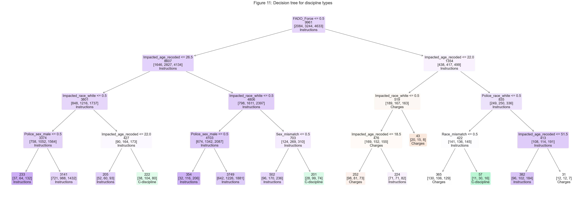
    


### 4-2-2. Decision tree model with years

In the decision tree model that includes the year variable, I added the incident year to explore the effect of time. It is important to note that this approach may provide a more intuitive understanding of the year's impact, as I directly adopted the year variable as a continuous variable, rather than converting it into a series of dummy variables. The setup of other variables remains the same as in the model without the year.

First, concerning model performance, the introduction of the year variable improved overall model accuracy by approximately 5%. More importantly, the year variable helped balance the previously poor performance in classifying the first two types of discipline outcomes (Charges and Command Discipline). As a result, it could be argued that the inclusion of the year variable is beneficial to the model's performance to some extent.

In terms of results, the inclusion of the year variable reveals an interesting temporal effect that may influence the decision on penalty types. For instance, incidents occurring at several specific time points (e.g., the years 2001, 2005, and 2019) might produce different patterns of discipline types, which may reflect changes in enforcement or disciplinary standards. Consequently, based on this decision tree model with the year variable, we can argue that it provides intricate insights into long-term trends and the impact of evolving policies. Future studies could further investigate what mechanisms were introduced at these critical time points and how these mechanisms affect the outcome of penalty types.


```python
# Setting the independent variables (X) and the dependent variable (y)
X = new_df[['Police_rank_mangerial', 'Police_sex_male', 'Police_race_white', 
            'Impacted_sex_male', 'Impacted_age_recoded', 'Impacted_race_white',
            'FADO_Discourtesy', 'FADO_Force', 'FADO_Offensive language',
            'Sex_mismatch', 'Race_mismatch','IncidentYear']]
y = new_df['Penalty_categories']
```


```python
# Split data into training and testing sets
X_train, X_test, y_train, y_test = train_test_split(X, y, test_size=0.3, random_state=676)
```


```python
# Train the decision tree classifier
dtree = DecisionTreeClassifier(max_depth=4, random_state=676,
                                min_samples_split=20,    # Minimum number of samples required to consider a split
                                min_samples_leaf=10,     # Minimum samples in a leaf
                                max_leaf_nodes=15)        # Maximum number of leaf nodes) # Adjust depth as necessary
dtree.fit(X_train, y_train)
```


<style>#sk-container-id-2 {color: black;}#sk-container-id-2 pre{padding: 0;}#sk-container-id-2 div.sk-toggleable {background-color: white;}#sk-container-id-2 label.sk-toggleable__label {cursor: pointer;display: block;width: 100%;margin-bottom: 0;padding: 0.3em;box-sizing: border-box;text-align: center;}#sk-container-id-2 label.sk-toggleable__label-arrow:before {content: "▸";float: left;margin-right: 0.25em;color: #696969;}#sk-container-id-2 label.sk-toggleable__label-arrow:hover:before {color: black;}#sk-container-id-2 div.sk-estimator:hover label.sk-toggleable__label-arrow:before {color: black;}#sk-container-id-2 div.sk-toggleable__content {max-height: 0;max-width: 0;overflow: hidden;text-align: left;background-color: #f0f8ff;}#sk-container-id-2 div.sk-toggleable__content pre {margin: 0.2em;color: black;border-radius: 0.25em;background-color: #f0f8ff;}#sk-container-id-2 input.sk-toggleable__control:checked~div.sk-toggleable__content {max-height: 200px;max-width: 100%;overflow: auto;}#sk-container-id-2 input.sk-toggleable__control:checked~label.sk-toggleable__label-arrow:before {content: "▾";}#sk-container-id-2 div.sk-estimator input.sk-toggleable__control:checked~label.sk-toggleable__label {background-color: #d4ebff;}#sk-container-id-2 div.sk-label input.sk-toggleable__control:checked~label.sk-toggleable__label {background-color: #d4ebff;}#sk-container-id-2 input.sk-hidden--visually {border: 0;clip: rect(1px 1px 1px 1px);clip: rect(1px, 1px, 1px, 1px);height: 1px;margin: -1px;overflow: hidden;padding: 0;position: absolute;width: 1px;}#sk-container-id-2 div.sk-estimator {font-family: monospace;background-color: #f0f8ff;border: 1px dotted black;border-radius: 0.25em;box-sizing: border-box;margin-bottom: 0.5em;}#sk-container-id-2 div.sk-estimator:hover {background-color: #d4ebff;}#sk-container-id-2 div.sk-parallel-item::after {content: "";width: 100%;border-bottom: 1px solid gray;flex-grow: 1;}#sk-container-id-2 div.sk-label:hover label.sk-toggleable__label {background-color: #d4ebff;}#sk-container-id-2 div.sk-serial::before {content: "";position: absolute;border-left: 1px solid gray;box-sizing: border-box;top: 0;bottom: 0;left: 50%;z-index: 0;}#sk-container-id-2 div.sk-serial {display: flex;flex-direction: column;align-items: center;background-color: white;padding-right: 0.2em;padding-left: 0.2em;position: relative;}#sk-container-id-2 div.sk-item {position: relative;z-index: 1;}#sk-container-id-2 div.sk-parallel {display: flex;align-items: stretch;justify-content: center;background-color: white;position: relative;}#sk-container-id-2 div.sk-item::before, #sk-container-id-2 div.sk-parallel-item::before {content: "";position: absolute;border-left: 1px solid gray;box-sizing: border-box;top: 0;bottom: 0;left: 50%;z-index: -1;}#sk-container-id-2 div.sk-parallel-item {display: flex;flex-direction: column;z-index: 1;position: relative;background-color: white;}#sk-container-id-2 div.sk-parallel-item:first-child::after {align-self: flex-end;width: 50%;}#sk-container-id-2 div.sk-parallel-item:last-child::after {align-self: flex-start;width: 50%;}#sk-container-id-2 div.sk-parallel-item:only-child::after {width: 0;}#sk-container-id-2 div.sk-dashed-wrapped {border: 1px dashed gray;margin: 0 0.4em 0.5em 0.4em;box-sizing: border-box;padding-bottom: 0.4em;background-color: white;}#sk-container-id-2 div.sk-label label {font-family: monospace;font-weight: bold;display: inline-block;line-height: 1.2em;}#sk-container-id-2 div.sk-label-container {text-align: center;}#sk-container-id-2 div.sk-container {/* jupyter's `normalize.less` sets `[hidden] { display: none; }` but bootstrap.min.css set `[hidden] { display: none !important; }` so we also need the `!important` here to be able to override the default hidden behavior on the sphinx rendered scikit-learn.org. See: https://github.com/scikit-learn/scikit-learn/issues/21755 */display: inline-block !important;position: relative;}#sk-container-id-2 div.sk-text-repr-fallback {display: none;}</style><div id="sk-container-id-2" class="sk-top-container"><div class="sk-text-repr-fallback"><pre>DecisionTreeClassifier(max_depth=4, max_leaf_nodes=15, min_samples_leaf=10,
                       min_samples_split=20, random_state=676)</pre><b>In a Jupyter environment, please rerun this cell to show the HTML representation or trust the notebook. <br />On GitHub, the HTML representation is unable to render, please try loading this page with nbviewer.org.</b></div><div class="sk-container" hidden><div class="sk-item"><div class="sk-estimator sk-toggleable"><input class="sk-toggleable__control sk-hidden--visually" id="sk-estimator-id-2" type="checkbox" checked><label for="sk-estimator-id-2" class="sk-toggleable__label sk-toggleable__label-arrow">DecisionTreeClassifier</label><div class="sk-toggleable__content"><pre>DecisionTreeClassifier(max_depth=4, max_leaf_nodes=15, min_samples_leaf=10,
                       min_samples_split=20, random_state=676)</pre></div></div></div></div></div>


```python
# Evaluate the model
y_pred = dtree.predict(X_test) # Predict on the testing set
accuracy = accuracy_score(y_test, y_pred)
print("Accuracy:", accuracy)
print("Confusion Matrix:\n", confusion_matrix(y_test, y_pred))
print("Classification Report:\n", classification_report(y_test, y_pred))
```

    Accuracy: 0.5163934426229508
    Confusion Matrix:
     [[  66  224  614]
     [  25  344 1015]
     [  20  167 1795]]
    Classification Report:
                                 precision    recall  f1-score   support
    
    Charges and specifications       0.59      0.07      0.13       904
            Command discipline       0.47      0.25      0.32      1384
    Instructions and trainings       0.52      0.91      0.66      1982
    
                      accuracy                           0.52      4270
                     macro avg       0.53      0.41      0.37      4270
                  weighted avg       0.52      0.52      0.44      4270
    


```python
# Setup the figure and axes for a clearer view
plt.figure(figsize=(60, 20))  # Adjusting figure size for better aspect ratio

# Update for font sizes
plt.rcParams.update({
    'font.size': 14,  # Setting a base size for smaller text elements
    'axes.titlesize': 24,  # Larger title
    'axes.labelsize': 20  # Larger axes labels
})

# Plot the decision tree
plot_tree(dtree, filled=True, 
          feature_names=X.columns.tolist(), 
          class_names=['Charges', 'C-discipline', 'Instructions'],
          rounded=True, proportion=False, precision=2,
          impurity=False,  # Do not show the impurity
          label='none',
          fontsize=20)  # Increased fontsize for better readability of the nodes

# Title for the plot
plt.title("Figure 12: Decision tree for disciplne types")
plt.show()
```


    
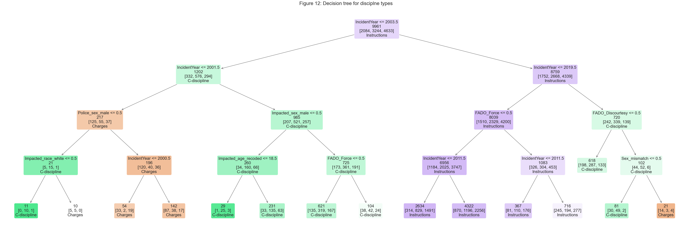
    


# 5. Conclusion

This pilot project utilizes NYPD Misconduct Complaint data to explore two research questions: (1) What factors explain whether police officers are penalized for their misconduct? and (2) Among officers who received penalties, what factors explain the variation in penalties given? Two distinct statistical approaches are employed: regression models and decision tree models.

The results from the regression models reveal two interesting implications. First, managerial officers may be more likely to receive discipline, and incidents involving older populations, males, or abuse of authority might be more frequently determined as requiring police agencies to administer penalties to officers. Secondly, by introducing a time-fixed effect in the linear probability model, no significant racial effect on discipline outcomes was found. This absence may result not only from the heterogeneous effects among racial groups, due to our data pre-processing strategies, but also from increased caution exercised by officers in racially charged encounters. Given this, future studies could employ a more sophisticated classification for racial groups to unravel nuanced differences.

Regarding the decision tree models, both models illustrate the dynamics and interactions among discipline types and several critical conditions, such as age, sex mismatch, race, the presence of force in an incident, and the officers' ranks. More importantly, in the decision tree model that includes the year variable, it shows the possible temporal effects on the discipline types that might be given to officers under different time spans. It is worth examining what triggers these changes over different time frames and how the linkage between policing strategies (e.g., policing guidelines) exercised in different periods influences discipline outcomes.

This pilot project is not without limitations. Data limitations are the most prevalent in this study. For example, information on impacted persons is mostly self-reported, and missing values are common in these variables. As observed in the regression models, we could only retain 154,460 observations in our statistical analysis, meaning nearly half of the dataset was excluded due to missing values. Another limitation might stem from relying solely on a single dataset. The decisions on penalties and discipline types might be influenced by many variables not included in this dataset, such as internal investigation reports or judicial documents related to the incidents. It is possible, yet challenging, for future studies to incorporate different types of datasets to provide more evidence to explain the outcomes of police officers' disciplines, in both regression models and decision tree models. Lastly, some text-based variables, such as penalty types or allegation types, might be too loosely defined, and the current dataset does not contain more detailed information about these variables. If more comprehensive descriptions of these variables become available, it might be feasible in the future to employ text-mining strategies to uncover insights that reflect the complex situations faced not only by police officers but also by impacted persons who initiated the complaints.
